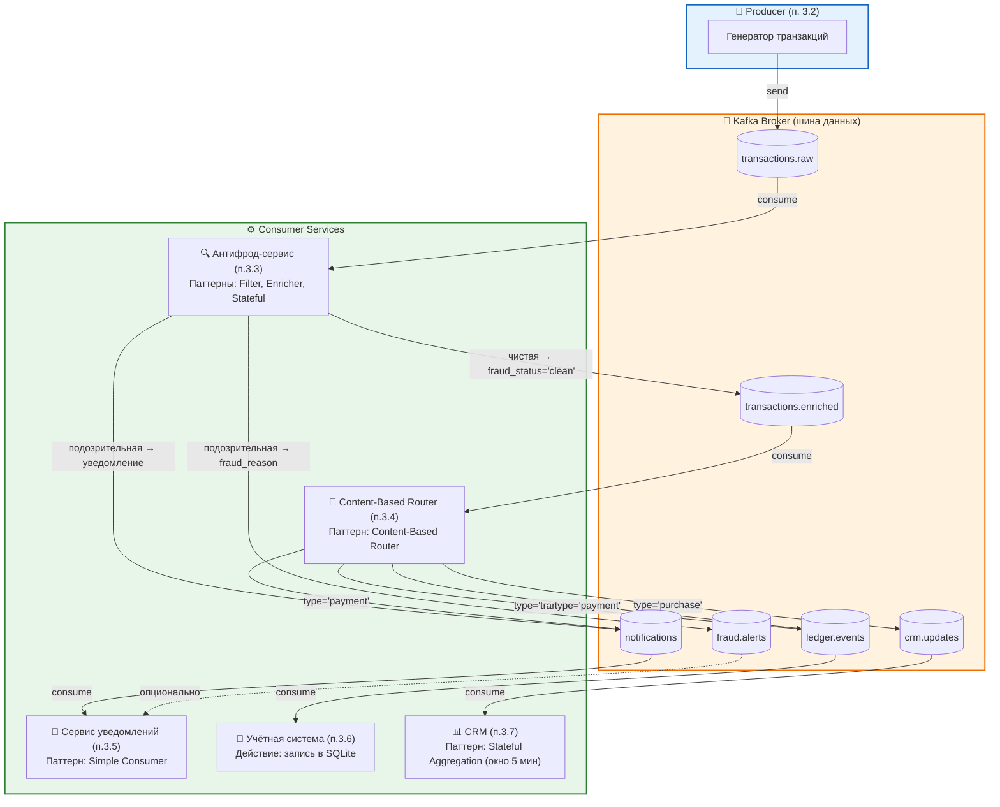

```mermaid
flowchart TB
    subgraph Producer["🎲 Producer (п. 3.2)"]
        Gen[Генератор транзакций]
    end

    subgraph Kafka["📨 Kafka Broker (шина данных)"]
        Raw[(transactions.raw)]
        Enriched[(transactions.enriched)]
        FraudAlerts[(fraud.alerts)]
        Notifications[(notifications)]
        Ledger[(ledger.events)]
        CRM[(crm.updates)]
    end

    subgraph Consumers["⚙️ Consumer Services"]
        FraudSvc["🔍 Антифрод-сервис (п.3.3)<br/>Паттерны: Filter, Enricher, Stateful"]
        RouterSvc["🧭 Content-Based Router (п.3.4)<br/>Паттерн: Content‑Based Router"]
        NotifySvc["📧 Сервис уведомлений (п.3.5)<br/>Паттерн: Simple Consumer"]
        LedgerSvc["📒 Учётная система (п.3.6)<br/>Действие: запись в SQLite"]
        CRMSvc["📊 CRM (п.3.7)<br/>Паттерн: Stateful Aggregation (окно 5 мин)"]
    end

    Gen -->|send| Raw

    Raw -->|consume| FraudSvc
    FraudSvc -->|чистая → fraud_status='clean'| Enriched
    FraudSvc -->|подозрительная → fraud_reason| FraudAlerts
    FraudSvc -->|подозрительная → уведомление| Notifications

    Enriched -->|consume| RouterSvc
    RouterSvc -->|type='purchase'| CRM
    RouterSvc -->|type='transfer'| Ledger
    RouterSvc -->|type='payment'| Ledger
    RouterSvc -->|type='payment'| Notifications

    CRM -->|consume| CRMSvc
    Ledger -->|consume| LedgerSvc
    Notifications -->|consume| NotifySvc
    FraudAlerts -.->|опционально| NotifySvc

    style Producer fill:#E3F2FD,stroke:#1565C0,stroke-width:2px
    style Kafka fill:#FFF3E0,stroke:#EF6C00,stroke-width:2px
    style Consumers fill:#E8F5E9,stroke:#2E7D32,stroke-width:2px
```
