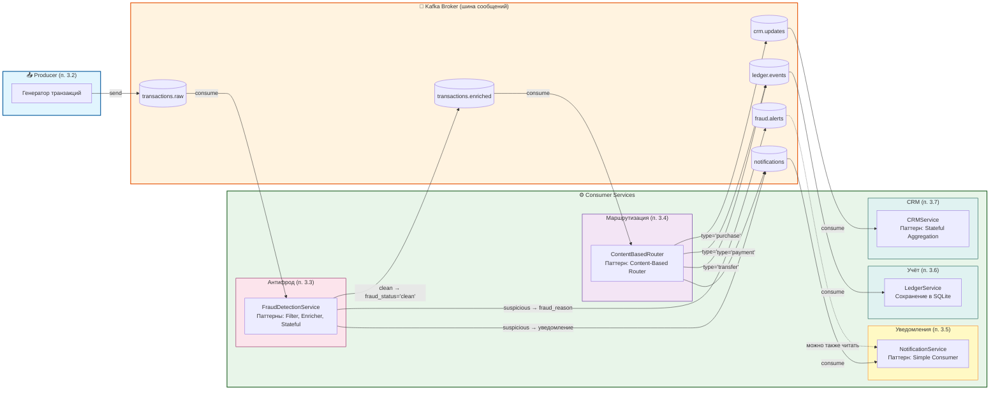

```mermaid
flowchart LR
    subgraph Producer["📤 Producer (п. 3.2)"]
        Gen[Генератор транзакций]
    end

    subgraph Kafka["🔄 Kafka Broker (шина сообщений)"]
        direction LR
        Raw[(transactions.raw)]
        Enriched[(transactions.enriched)]
        FraudAlerts[(fraud.alerts)]
        Notifications[(notifications)]
        Ledger[(ledger.events)]
        CRM[(crm.updates)]
    end

    subgraph Consumers["⚙️ Consumer Services"]
        direction TB
        
        subgraph FraudGroup["Антифрод (п. 3.3)"]
            Fraud[FraudDetectionService<br/>Паттерны: Filter, Enricher, Stateful]
        end
        
        subgraph RouterGroup["Маршрутизация (п. 3.4)"]
            Router[ContentBasedRouter<br/>Паттерн: Content-Based Router]
        end
        
        subgraph NotifyGroup["Уведомления (п. 3.5)"]
            Notify[NotificationService<br/>Паттерн: Simple Consumer]
        end
        
        subgraph LedgerGroup["Учёт (п. 3.6)"]
            LedgerService[LedgerService<br/>Сохранение в SQLite]
        end
        
        subgraph CRMGroup["CRM (п. 3.7)"]
            CRMService[CRMService<br/>Паттерн: Stateful Aggregation]
        end
    end

    %% Producer → Kafka
    Gen -->|send| Raw

    %% Kafka → Fraud (consumer)
    Raw -->|consume| Fraud
    
    %% Fraud → Kafka (producer)
    Fraud -->|"clean → fraud_status='clean'"| Enriched
    Fraud -->|"suspicious → fraud_reason"| FraudAlerts
    Fraud -->|"suspicious → уведомление"| Notifications

    %% Enriched → Router
    Enriched -->|consume| Router

    %% Router → Kafka (producer)
    Router -->|"type='purchase'"| CRM
    Router -->|"type='transfer'"| Ledger
    Router -->|"type='payment'"| Ledger
    Router -->|"type='payment'"| Notifications

    %% Kafka → final consumers
    CRM -->|consume| CRMService
    Ledger -->|consume| LedgerService
    Notifications -->|consume| Notify
    FraudAlerts -.->|"можно также читать"| Notify

    %% Стилизация
    style Producer fill:#e1f5fe,stroke:#01579b,stroke-width:2px
    style Kafka fill:#fff3e0,stroke:#e65100,stroke-width:2px
    style Consumers fill:#e8f5e9,stroke:#1b5e20,stroke-width:2px
    style FraudGroup fill:#fce4ec,stroke:#880e4f
    style RouterGroup fill:#f3e5f5,stroke:#4a148c
    style NotifyGroup fill:#fff9c4,stroke:#f57f17
    style LedgerGroup fill:#e0f2f1,stroke:#004d40
    style CRMGroup fill:#e0f2f1,stroke:#004d40
```
