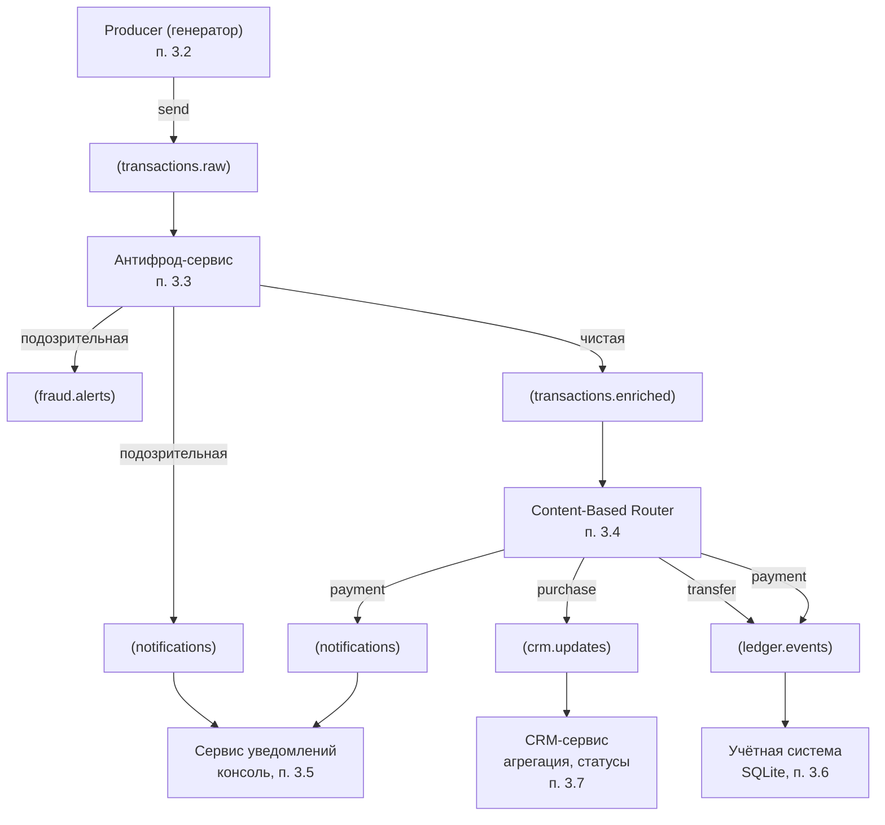

```mermaid
flowchart TD
    Producer["Producer (генератор)<br/>п. 3.2"] -->|send| Raw["(transactions.raw)"]

    Raw --> Fraud["Антифрод-сервис<br/>п. 3.3"]

    Fraud -->|"подозрительная"| FraudAlerts["(fraud.alerts)"]
    Fraud -->|"подозрительная"| Notif1["(notifications)"]
    Fraud -->|"чистая"| Enriched["(transactions.enriched)"]

    Enriched --> Router["Content-Based Router<br/>п. 3.4"]

    Router -->|"purchase"| CRM_topic["(crm.updates)"]
    Router -->|"transfer"| Ledger_topic["(ledger.events)"]
    Router -->|"payment"| Ledger_topic
    Router -->|"payment"| Notif2["(notifications)"]

    CRM_topic --> CRM_Service["CRM-сервис<br/>агрегация, статусы<br/>п. 3.7"]
    Ledger_topic --> Ledger_Service["Учётная система<br/>SQLite, п. 3.6"]
    Notif1 --> Notify_Service["Сервис уведомлений<br/>консоль, п. 3.5"]
    Notif2 --> Notify_Service
```
