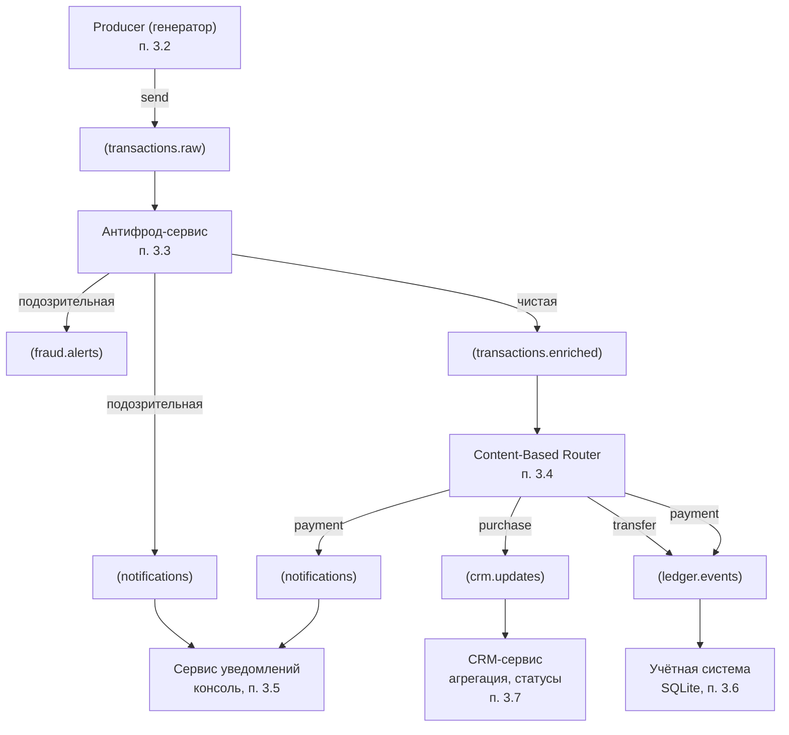

## Архитектура интеграционного решения на базе Apache Kafka

Проект реализует **событийно-ориентированную архитектуру (EDA)** с использованием Apache Kafka в качестве центральной шины сообщений. Система обрабатывает финансовые транзакции в реальном времени: проверяет их на мошенничество, обогащает и маршрутизирует в профильные сервисы (учёт, CRM, уведомления).

### Используемые паттерны интеграции

| Паттерн | Где реализован | Назначение |
|---------|----------------|-------------|
| **Publish‑Subscribe** | Kafka + все consumer'ы | Независимое чтение топиков несколькими сервисами |
| **Message Filter** | Антифрод-сервис (п.3.3) | Подозрительные транзакции не попадают в `enriched` |
| **Content‑Based Router** | Маршрутизатор (п.3.4) | Перенаправление транзакций в зависимости от `type` |
| **Stateful Processing** | Антифрод (30 сек) / CRM (5 мин) | Оконные агрегации (ручная реализация) |
| **Message Enricher** | Антифрод-сервис | Добавление полей `fraud_status` / `fraud_reason` |

### Топики и потоки данных

### Краткий поток одной транзакции

1. **Генератор** (п.3.2) отправляет JSON‑сообщение в `transactions.raw`.
2. **Антифрод** (п.3.3) проверяет правила (сумма >150k, перевод >50k, >5 транзакций за 30 сек).  
   - Если чистая → обогащает `fraud_status="clean"` → `transactions.enriched`.  
   - Если подозрительная → `fraud.alerts` + `notifications`.
3. **Маршрутизатор** (п.3.4) читает `transactions.enriched` и по полю `type` направляет:  
   - `purchase` → `crm.updates`  
   - `transfer` → `ledger.events`  
   - `payment` → `ledger.events` + `notifications`
4. **Сервисы-потребители**:
   - **Учётная система** сохраняет транзакции в SQLite.
   - **CRM** агрегирует сумму покупок за 5 минут, при пороге >200 000 руб. повышает статус.
   - **Уведомления** выводят в консоль статус операции (успех / блокировка).

### Особенности реализации

- Из‑за отсутствия Docker на локальной машине **бизнес‑логика отлаживалась на имитационной модели Kafka** (`MockKafkaTopic`).  
- Полноценный `docker-compose.yml` для запуска реального Kafka + Zookeeper прилагается.  
- Stateful‑обработка (окна 30 сек и 5 мин) реализована **вручную** через `defaultdict(list)` – без Faust, но с полным соблюдением логики задания.

